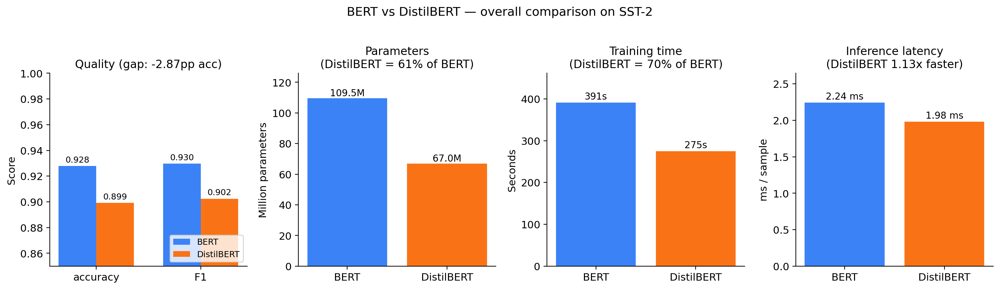
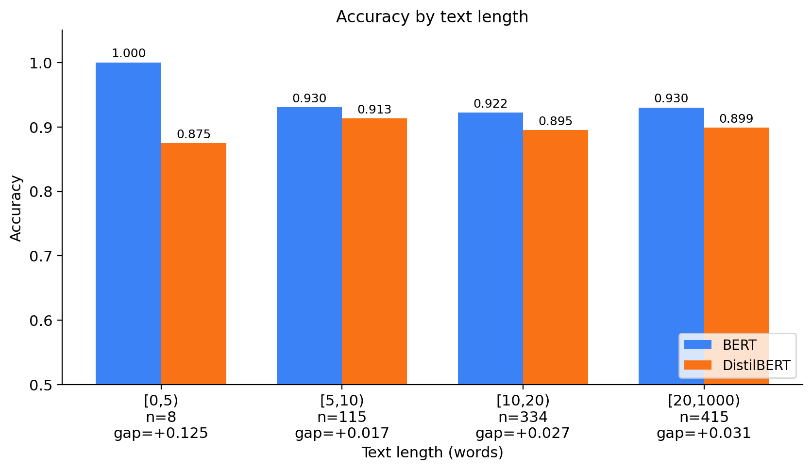
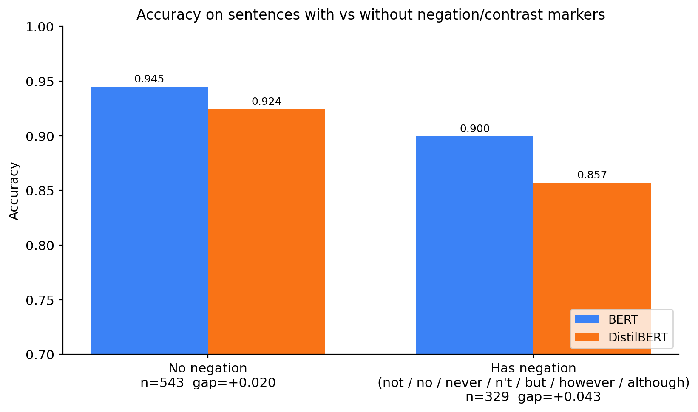
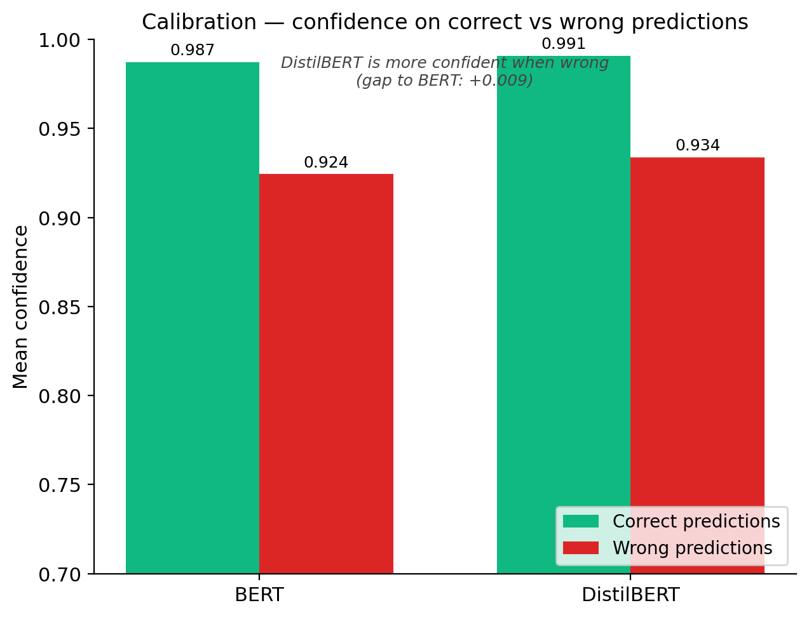

# DistilBERT vs BERT — Error Analysis on SST-2, IMDb, and MRPC

We fine-tune `bert-base-uncased` and `distilbert-base-uncased` on three
GLUE-style benchmarks: **SST-2** (short, single-sentence sentiment),
**IMDb** (long, multi-paragraph sentiment), and **MRPC** (sentence-pair
paraphrase identification). The goal is to characterise **what kinds of
inputs the distilled student loses on relative to the teacher, and where
it wins**.

> Research question: *How much performance is lost by distillation, and
> what kinds of examples are most affected?*

---

## Table of Contents
* [Headline Results](#headline-results)
    * [Aggregate Metrics](#aggregate-metrics)
    * [Comparison to Paper](#comparison-to-the-distilbert-paper)
    * [Where the Gap Lives](#where-the-gap-lives)
* [Repository Structure](#repository-structure)
* [Reproducing the Experiments](#reproducing-the-experiments)
* [Findings](#findings)
    * [SST-2 Analysis](#sst-2-short-single-sentence--41-disagreements-4-themes)
    * [IMDb Analysis](#imdb-long-multi-paragraph--1190-disagreements-4-themes)
    * [MRPC Analysis](#mrpc-sentence-pair-paraphrase--56-disagreements-student-wins)
* [Discussion](#discussion)
* [Limitations](#limitations)
* [Future Work](#future-work)
* [Conclusion](#conclusion)

---

## Headline results

### Aggregate metrics


|  | SST-2 (n = 872 val) |  | IMDb (n = 25,000 test) |  | MRPC (n = 408 val) |  |
|---|---:|---:|---:|---:|---:|---:|
|  | **BERT** | **DistilBERT** | **BERT** | **DistilBERT** | **BERT** | **DistilBERT** |
| Accuracy | **0.928** | 0.899 | **0.924** | 0.916 | 0.821 | **0.836** |
| F1 | **0.930** | 0.902 | **0.925** | 0.916 | 0.876 | **0.883** |
| Accuracy gap (pp) |  | −2.87 |  | −0.84 |  | **+1.47** |
| Training time (3 epochs, T4) | 391 s | 275 s | 1013 s | 530 s | 52 s | 31 s |
| Training speed-up (DistilBERT vs BERT) |  | 1.42× |  | 1.91× |  | 1.65× |
| Parameters | 109.5 M | 67.0 M | 109.5 M | 67.0 M | 109.5 M | 67.0 M |
| Inference latency (ms / sample, eval throughput) | 2.24 | 1.98 | 3.48 | 1.87 | 7.62 | 8.31 |
| Inference speed-up (DistilBERT vs BERT) |  | 1.13× |  | 1.86× |  | 0.92× † |
| Agreement rate (the two models give the same prediction) |  | 95.3% |  | 95.2% |  | 86.3% |

> Latency is computed as `1 / eval_samples_per_second` from `trainer.evaluate()` on the full evaluation set — same pipeline for all three datasets. **†** MRPC's validation set is small (408 samples ≈ 13 batches at batch size 32), so single-run latency is dominated by warm-up overhead and is not reliable as a head-to-head benchmark; we list it for consistency, but the size and training-time speed-ups remain valid.

DistilBERT is consistently the smaller and faster model, but its
accuracy story varies sharply across the three datasets: it loses by 2.87 pp
on SST-2, only 0.84 pp on IMDb, and **wins by 1.47 pp on MRPC**.

### Comparison to the DistilBERT paper

The original paper (Sanh et al., 2019) reports DistilBERT as 40% smaller,
60% faster, and retaining ~97% of BERT's language-understanding ability.
Our numbers track those claims, with MRPC as an interesting outlier:

| Paper claim | Our measurement | Trend |
|---|---|:-:|
| 40% smaller | 39% smaller (67.0M / 109.5M params) | ✓ |
| 60% faster (training) | 30% (SST-2) / 48% (IMDb) / 40% (MRPC) faster training | partial |
| Retains ~97% of capability | 96.9% (SST-2) / 99.1% (IMDb) / **101.8%** (MRPC) of BERT's accuracy | ✓+ |

The size and accuracy-retention numbers replicate the paper's headline
trends, and MRPC actually *exceeds* 100% retention, i.e. the student
beats the teacher. Our training-speed advantage is smaller than the
paper's claimed 60%, likely because all three runs hit the same
input-pipe and tokenization overhead on a single T4, which dominates
wall-clock at our batch sizes.

### Where the gap lives

The three datasets stress the student in different ways:

|  | SST-2 (short, single-sentence) | IMDb (long, multi-paragraph) | MRPC (sentence pair) |
|---|---|---|---|
| Headline gap | **−2.87 pp** | **−0.84 pp** | **+1.47 pp** (student wins) |
| Length effect | 1.7 pp (5–10 words) → 3.1 pp (20+ words) | 0.3 pp (<100 w) → **1.9 pp (400+ words)** | roughly flat across length buckets |
| Negation effect | gap doubles on negated sentences (4.3 pp vs 2.0 pp) | 97% of reviews contain a negation; flag is uninformative | gap similar with/without negation (−2.0 pp vs −1.2 pp; both favour DistilBERT) |
| Dominant failure mode | local compositionality (negation, sarcasm, idiom) | long-document integration (buried verdicts, mixed sentiment) | BERT over-predicts paraphrase on high-overlap-but-different pairs |
| Agreement rate | 95.3% | 95.2% | **86.3%** |

#### Performance Drivers: Length and Negation
<p align="center">
  
  
</p>

The unifying observation: **DistilBERT loses where sentiment is encoded
compositionally**, i.e. through negation/sarcasm in short text (SST-2)
or through the position of the verdict in a long review (IMDb). On a
small sentence-pair task (MRPC, n_train = 3,668), the larger model's
extra capacity becomes a liability instead of an asset, and the student
wins by being more conservative. It refuses to call two sentences a
paraphrase just because they share lexical material.

Full numbers:
[`results/error_breakdown.json`](results/error_breakdown.json) (SST-2) ·
[`results/error_breakdown_imdb.json`](results/error_breakdown_imdb.json) (IMDb) ·
[`results/error_breakdown_mrpc.json`](results/error_breakdown_mrpc.json) (MRPC).
Figures:
[`results/figures/`](results/figures/) ·
[`results/figures_imdb/`](results/figures_imdb/) ·
[`results/figures_mrpc/`](results/figures_mrpc/).
Hand-annotated qualitative analysis:
[`results/case_studies.md`](results/case_studies.md) ·
[`results/case_studies_imdb.md`](results/case_studies_imdb.md) ·
[`results/case_studies_mrpc.md`](results/case_studies_mrpc.md).

---

## Repository structure

```
DistilBERT/
├── code/
│   ├── train_bert.py              # fine-tune bert-base-uncased (SST-2 or IMDb via --dataset)
│   ├── train_distilbert.py        # fine-tune distilbert-base-uncased on SST-2
│   ├── train_bert_imdb.py         # fine-tune bert-base-uncased on IMDb
│   ├── train_distilbert_imdb.py   # fine-tune distilbert-base-uncased on IMDb
│   ├── train_bert_mrpc.py         # fine-tune bert-base-uncased on MRPC
│   ├── train_distilbert_mrpc.py   # fine-tune distilbert-base-uncased on MRPC
│   ├── predict.py                 # load fine-tuned model, write per-sample CSV (--dataset sst2|imdb)
│   ├── predict_mrpc.py            # MRPC pair-aware inference (separate file due to pair tokenization)
│   ├── predict_bert.py            # earlier all-in-one (train+predict) variant
│   ├── predict_distilbert.py      # earlier predict-only variant (Colab paths)
│   ├── error_analysis.py          # 4-category breakdown + length / negation / confidence stats
│   ├── extract_cases.py           # rank disagreements → case_studies_candidates*.csv
│   └── make_figures.py            # 7 figures per dataset
│
├── data/
│   ├── SST2.py                    # GLUE SST-2 loader + tokenizer wrapper
│   ├── IMDB.py                    # IMDb loader + tokenizer wrapper
│   └── MRPC.py                    # GLUE MRPC loader + sentence-pair tokenizer wrapper
│
├── results/
│   ├── README.md
│   │
│   ├── train_bert_sst2.json                  # SST-2 BERT training metrics
│   ├── train_bert_sst2_history.json
│   ├── distilbert_sst2_config.json           # SST-2 DistilBERT training metrics
│   ├── distilbert_sst2_results.txt
│   ├── predict_bert_sst2.csv                 # SST-2 per-sample BERT predictions
│   ├── predict_distilbert_sst2.csv           # SST-2 per-sample DistilBERT predictions
│   ├── merged_predictions_sst2.csv           # joined + 4-category labelled
│   ├── error_breakdown.json                  # SST-2 aggregate error analysis
│   ├── case_studies.md                       # SST-2 qualitative analysis
│   ├── case_studies_candidates.csv           # SST-2 disagreements, ranked
│   ├── figures/                              # SST-2 figures (7 PNGs)
│   │
│   ├── train_bert_imdb.json                  # IMDb BERT training metrics
│   ├── distilbert_imdb_config.json           # IMDb DistilBERT training metrics
│   ├── distilbert_imdb_results.txt
│   ├── predict_bert_imdb.csv                 # IMDb per-sample BERT predictions
│   ├── predict_distilbert_imdb.csv           # IMDb per-sample DistilBERT predictions
│   ├── merged_predictions_imdb.csv           # joined + 4-category labelled
│   ├── error_breakdown_imdb.json             # IMDb aggregate error analysis
│   ├── case_studies_imdb.md                  # IMDb qualitative analysis
│   ├── case_studies_candidates_imdb.csv      # IMDb disagreements, ranked
│   ├── figures_imdb/                         # IMDb figures (7 PNGs)
│   │
│   ├── train_bert_mrpc.json                  # MRPC BERT training metrics
│   ├── distilbert_mrpc_config.json           # MRPC DistilBERT training metrics
│   ├── distilbert_mrpc_results.txt
│   ├── predict_bert_mrpc.csv                 # MRPC per-sample BERT predictions
│   ├── predict_distilbert_mrpc.csv           # MRPC per-sample DistilBERT predictions
│   ├── merged_predictions_mrpc.csv           # joined + 4-category labelled
│   ├── error_breakdown_mrpc.json             # MRPC aggregate error analysis
│   ├── case_studies_mrpc.md                  # MRPC qualitative analysis
│   ├── case_studies_candidates_mrpc.csv      # MRPC disagreements, ranked
│   └── figures_mrpc/                         # MRPC figures (7 PNGs)
│
└── README.md
```

---

## Reproducing the experiments

The training steps need a GPU; the analysis steps run locally on CPU.

### 1. Setup

```bash
git clone https://github.com/JodieeT/DistilBERT.git
cd DistilBERT
pip install transformers datasets evaluate scikit-learn pandas matplotlib
```

### 2. Fine-tune both models

```bash
# SST-2  (~12 min on a T4)
python code/train_bert.py --dataset sst2 --batch_size 32 --epochs 3
python code/train_distilbert.py

# IMDb  (~26 min on a T4)
python code/train_bert_imdb.py
python code/train_distilbert_imdb.py

# MRPC  (~2 min on a T4)
python code/train_bert_mrpc.py
python code/train_distilbert_mrpc.py
```

Writes the fine-tuned model checkpoints to `results/{sst2,imdb,mrpc}_bert_base/`
and `results/distilbert_{sst2,imdb,mrpc}_model/`. Model weight files are large
(~440 MB BERT, ~270 MB DistilBERT) and are *not* committed; only the small
metric JSON/TXT files are.

### 3. Generate per-sample prediction CSVs

```bash
python code/predict.py --model both --dataset sst2
python code/predict.py --model both --dataset imdb
python code/predict_mrpc.py --model both
```

Writes `results/predict_{bert,distilbert}_{dataset}.csv`, one row per
evaluation sample, with text(s), true label, predicted label, confidence,
length, and a negation flag. MRPC has its own predict script because it uses
sentence-pair tokenization (`tokenizer(s1, s2)`) instead of single-text
tokenization.

(`predict_bert.py` and `predict_distilbert.py` are earlier variants kept
for record; `predict_distilbert.py` has hardcoded Colab paths and will not
run as-is locally.)

### 4. Run the error analysis

```bash
python code/error_analysis.py --dataset sst2
python code/error_analysis.py --dataset imdb
python code/error_analysis.py --dataset mrpc
```

Joins the two prediction CSVs for each dataset, labels each row with one
of four categories (`both_correct`, `both_wrong`, `bert_only_correct`,
`distilbert_only_correct`), and computes per-category statistics, length
buckets, negation splits, and confidence stats. Outputs:

- `results/merged_predictions_{dataset}.csv`
- `results/error_breakdown.json` (SST-2) /
  `results/error_breakdown_imdb.json` /
  `results/error_breakdown_mrpc.json`

### 5. Generate figures

```bash
python code/make_figures.py --dataset sst2
python code/make_figures.py --dataset imdb
python code/make_figures.py --dataset mrpc
```

Writes seven figures per dataset, to `results/figures/`,
`results/figures_imdb/`, and `results/figures_mrpc/` respectively:

| File | What it shows |
|---|---|
| `fig1_overall_metrics.png` | accuracy, F1, parameter count, training time, inference latency |
| `fig2_error_categories.png` | how the samples split across the 4 categories |
| `fig3_length_buckets.png` | accuracy vs text length (per-dataset bucketing) |
| `fig4_negation_split.png` | accuracy on sentences with vs without negation/contrast markers |
| `fig5_length_per_category.png` | text-length distribution per error category |
| `fig6_confidence_scatter.png` | per-sample BERT vs DistilBERT confidence, coloured by category |
| `fig7_confidence_calibration.png` | mean confidence on correct vs wrong predictions |

### 6. Inspect the disagreement cases

```bash
python code/extract_cases.py --dataset sst2
python code/extract_cases.py --dataset imdb
python code/extract_cases.py --dataset mrpc
```

Writes `results/case_studies_candidates{,_imdb,_mrpc}.csv` listing all
disagreements between the two models, ranked by how confidently the
wrong model held its position. The hand-curated subsets with
linguistic-phenomenon labels live in
[`results/case_studies.md`](results/case_studies.md) (SST-2),
[`results/case_studies_imdb.md`](results/case_studies_imdb.md) (IMDb), and
[`results/case_studies_mrpc.md`](results/case_studies_mrpc.md) (MRPC).

---

## Findings

### SST-2 (short, single-sentence) — 41 disagreements, 4 themes

1. **Polarity reversal via negation** — a single negation flips an
   otherwise positive surface (*"i don't think i laughed out loud once"*).
2. **Contrastive / concessive structure** — verdict is in the second
   clause after `but / though` (*"outer-space buffs might love this film,
   but others will find its pleasures intermittent"*).
3. **Sarcasm and metaphor** — surface words point the wrong way (*"the
   iditarod lasts for days — this just felt like it did"*).
4. **Understated / idiomatic positive** — *almost unsurpassed*, *not the
   least of which*, *shades of gray* all read as negative on the surface.

Per-case discussion: [`results/case_studies.md`](results/case_studies.md).

### IMDb (long, multi-paragraph) — 1,190 disagreements, 4 themes

1. **Buried verdict in long review** — plot summary or descriptive praise
   dominates the document; the verdict arrives in the last paragraph and
   DistilBERT misses it.
2. **Temporal / sentiment reversal** — *"I loved this movie as a kid…
   watching it again as an adult, this film is terrible."*
3. **Ironic / understated polarity** — ostensibly positive phrasing
   conveys a negative verdict (*"great movie to sit down with a six-pack
   — DO NOT see this movie sober"*).
4. **Reverse direction (DistilBERT correct, BERT wrong)** — most often
   contrastive ("X is a mess, **but** an entertaining mess"), where BERT
   over-weights the negative descriptors before the pivot.

Per-case discussion: [`results/case_studies_imdb.md`](results/case_studies_imdb.md).

### MRPC (sentence-pair paraphrase) — 56 disagreements, student wins

Different story from sentiment. Of the 56 disagreements, 25 are BERT-only
correct and **31 are DistilBERT-only correct**. Inside that 31, **71% are
non-paraphrases that BERT incorrectly called paraphrases** — i.e. BERT's
dominant failure mode is being *over-confident that two sentences sharing
surface material are paraphrases*. Recurring patterns:

1. **Subset / asymmetric content** — one sentence carries an extra clause
   or qualifier the other does not (*"GE stock closed Friday at $30.65,
   down about 42 cents"* vs *"GE's shares closed at $30.65 on Friday"*).
   BERT calls these paraphrases; DistilBERT does not.
2. **Numeric / quantitative mismatch** — different numbers (*27 troops*
   vs *26 troops*, *2 killed* vs *1 killed*) where DistilBERT's stricter
   matching helps on non-paraphrases but occasionally hurts on
   paraphrases that the gold annotation treats as equivalent.
3. **Tense / role substitution** — *wife → widow*, first-person speaker
   → named third-person — small lexical changes that flip world-state.
4. **Quoted-content with different speaker context** — same quote,
   different attribution.

Per-case discussion: [`results/case_studies_mrpc.md`](results/case_studies_mrpc.md).

---

## Discussion

Our analysis suggests that the performance gap between BERT and DistilBERT is systematic, driven by specific linguistic and structural challenges.

### 1. The Challenge of Compositionality
DistilBERT struggles with **compositional sentiment**. On SST-2, errors frequently stem from negation and contrastive structures. In these instances, sentiment is not determined by individual tokens but by their structural combination. DistilBERT tends to rely on surface lexical cues, often failing to correctly interpret the **logical scope** of functional tokens like "not" or "but."

### 2. Long-Context Reasoning in IMDb
On IMDb, the dominant issue is **long-document integration**. Reviews often feature mixed sentiment or delayed verdicts. DistilBERT appears to "average" representations across the document, leading it to overweight frequent sentiment cues (like plot descriptions) while missing the decisive judgment buried at the end. This explains why the gap increases significantly as review length grows.

### 3. Calibration and Overconfidence
<p align="center">
  
</p>

DistilBERT exhibits notable **overconfidence in its errors**. Even when predictions are incorrect, its confidence remains high (averaging 0.87–0.89), indicating poor calibration. The student model has not only lost accuracy but also the ability to signal its own uncertainty, making confidence-based rejection an unreliable safety net.

### 4. Non-Uniform Degradation (The MRPC Paradox)
The student is not strictly worse in all cases. On MRPC, the larger model’s extra capacity becomes a liability, leading to over-confidence in "lexical overlap" (assuming two sentences are paraphrases just because they share words). DistilBERT’s more "conservative" decision boundary allows it to win by refusing to call these pairs paraphrases, suggesting that **distillation acts as a form of regularization** in low-data settings.

---

## Limitations

While our experiments provide useful insights into the trade-offs between BERT and DistilBERT, several limitations should be noted.

**1. Use of validation sets for both model selection and analysis**  
We use the validation sets for both model selection (via checkpoint selection) and downstream analysis. This may introduce mild bias, as the models are indirectly optimized on the same data used for evaluation. A strictly held-out test set would be required for an unbiased estimate of generalization performance.

**2. Limited dataset size, especially for MRPC**  
Some datasets used in this study are relatively small (e.g., MRPC with 3,668 training samples and 408 validation samples). This can lead to high variance in results and may partially explain why DistilBERT outperforms BERT in this setting. The findings may not generalize to larger or more diverse datasets.

**3. Limited hyperparameter exploration**  
We use standard fine-tuning settings (e.g., fixed learning rate, batch size, and number of epochs) without extensive hyperparameter tuning. It is possible that further optimization could reduce the observed performance gap between models or change some of the conclusions.

**4. Task and domain scope**  
Our experiments focus on three GLUE-style tasks (SST-2, IMDb, MRPC), which, while diverse, do not cover all NLP scenarios. In particular, we do not evaluate tasks requiring structured reasoning, multi-hop inference, or domain-specific knowledge, where the performance gap between models may differ.

**5. Approximate latency measurements**  
Inference latency is estimated from evaluation throughput on a single GPU (T4). These measurements are influenced by batch size, hardware configuration, and framework overhead, and may not fully reflect real-world deployment settings.

**6. Qualitative analysis is based on sampled examples**  
Our error analysis relies on manually inspecting a subset of misclassified examples. While this allows us to identify recurring patterns (e.g., negation, contrast, sarcasm), the conclusions are qualitative and may not capture all possible failure modes.

**7. Lack of calibration and uncertainty evaluation**  
Although we analyze prediction confidence, we do not perform formal calibration analysis (e.g., Expected Calibration Error). As a result, conclusions about model reliability based on confidence should be interpreted cautiously.

---

## Future Work

Building on our error analysis, several avenues for future research could further clarify the teacher-student relationship in distillation:

### 1. Robustness-Aware Distillation
Our findings show that DistilBERT struggles significantly with **compositional logic** (negation and sarcasm). Future work could explore augmenting the distillation loss function with:
* **Contrastive Loss:** Training on pairs of sentences where a single word (e.g., "not") flips the sentiment, forcing the student to attend to functional tokens.
* **Saliency Matching:** Forcing the student to mirror the teacher's attention maps specifically on negation keywords.

### 2. Generalization to "In-the-Wild" Data
While DistilBERT performed well on the curated IMDb and SST-2 datasets, its failure on **long-document integration** suggests it might struggle with real-world noise. Testing these models on "out-of-distribution" data—such as social media posts with non-standard grammar or professional technical reviews—would reveal if the performance gap widens in less "clean" environments.

### 3. Influence of Training Set Scale (The MRPC Paradox)
We observed that DistilBERT outperformed BERT on the small MRPC dataset. A systematic study could be conducted by **sub-sampling** larger datasets (like IMDb) to various sizes ($n = 500, 1000, 5000$) to find the "cross-over point" where a larger model's capacity transitions from a liability (overfitting) to an asset.

### 4. Beyond Prediction: Distilling Uncertainty
Our analysis showed that both models are often "confidently wrong." Future experiments could implement **Temperature Scaling** or **Label Smoothing** during the distillation process to see if the student can be trained to produce better-calibrated probability scores, making it safer for deployment in sensitive applications.

### 5. Alternative Architectures
Investigating whether other compressed models, such as **TinyBERT** (which uses hidden-state matching) or **MobileBERT**, suffer from the same compositional failures as DistilBERT would help determine if these weaknesses are inherent to "shallow" models or specific to the DistilBERT distillation method.

---

## Conclusion

This project reproduces and extends the main finding of the DistilBERT paper: a distilled model can retain much of BERT’s performance while using substantially fewer parameters and less training time. Across SST-2, IMDb, and MRPC, DistilBERT achieves strong accuracy with only about 61% of BERT’s parameter count.

However, the performance trade-off is task-dependent. On SST-2 and IMDb, DistilBERT underperforms BERT, especially on examples involving negation, contrastive structure, sarcasm, or long-document sentiment integration. On MRPC, DistilBERT slightly outperforms BERT, suggesting that smaller models may sometimes generalize better in low-data settings.

Overall, our results show that distillation is not simply a uniform compression-performance trade-off. Instead, the cost of compression depends on task structure, dataset size, and the linguistic complexity of the input.

---

## References

- Devlin, J. *et al.* (2019). *BERT: Pre-training of deep bidirectional
  transformers for language understanding.*
  [arXiv:1810.04805](https://arxiv.org/abs/1810.04805)
- Dolan, W. B., & Brockett, C. (2005). *Automatically constructing a
  corpus of sentential paraphrases.* (MRPC dataset)
- Maas, A. L. *et al.* (2011). *Learning word vectors for sentiment
  analysis.* (IMDb dataset)
- Sanh, V., Debut, L., Chaumond, J., & Wolf, T. (2019).
  *DistilBERT, a distilled version of BERT: smaller, faster, cheaper and
  lighter.* [arXiv:1910.01108](https://arxiv.org/abs/1910.01108)
- Socher, R. *et al.* (2013). *Recursive deep models for semantic
  compositionality over a sentiment treebank.* (SST-2 dataset)
